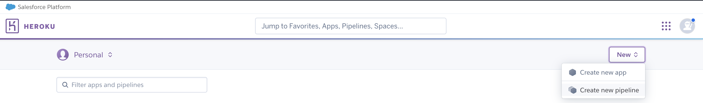
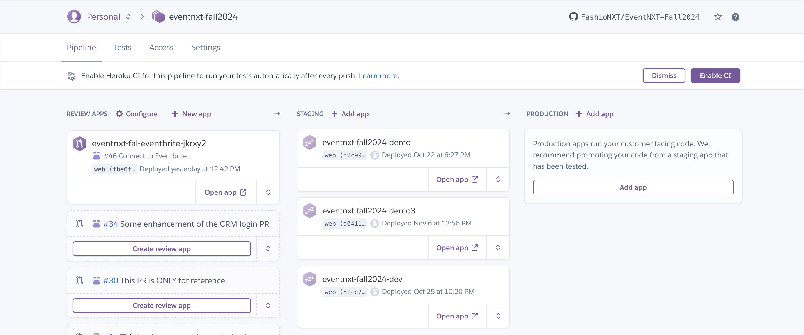
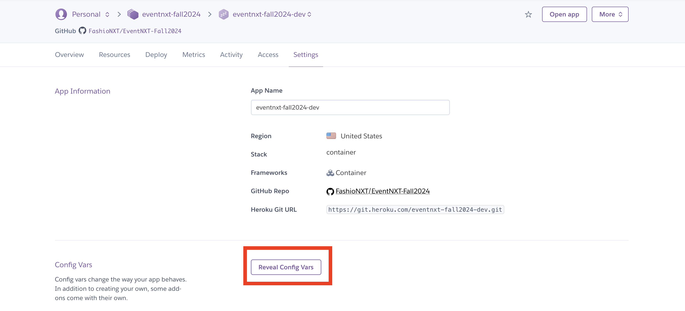
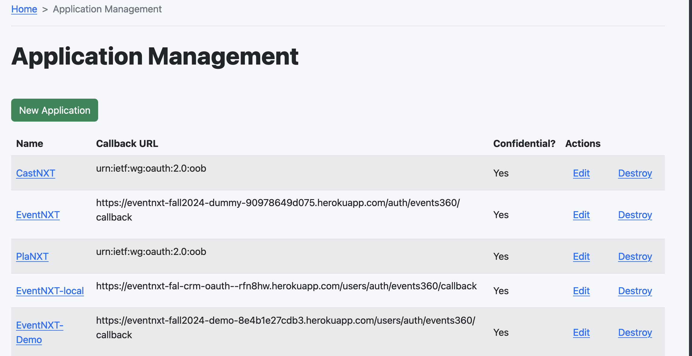
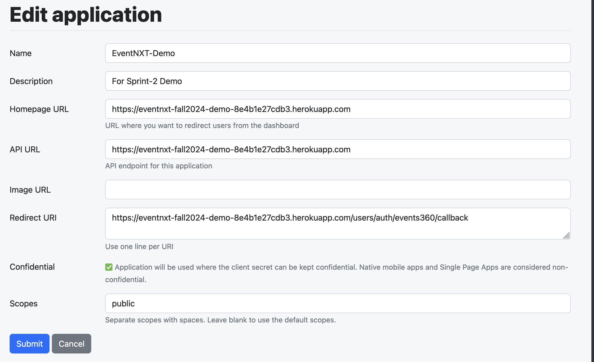

# Team EventNXT

TEAM Fall 2024

# Sprint 1 MVP

Heroku deployment: https://eventnxt-0fcb166cb5ae.herokuapp.com/ <br>
Document Summary: https://github.com/FashioNXT/EventNXT-Fall2024/blob/rishabh/documentation/Fall2024/Sprint%201%20MVP.pdf<br>
Code climate report: https://github.com/FashioNXT/EventNXT-Fall2024/blob/rishabh/documentation/Fall2024/code-cliamte-report.pdf
Team agreement Report: https://github.com/FashioNXT/EventNXT-Fall2024/blob/dev/documentation/Fall2024/team_agreement_report.md

# Sprint 2 MVP

- Heroku deployment: https://eventnxt-fall2024-dev-67890e38df3f.herokuapp.com/
- Document Summary: https://github.com/FashioNXT/EventNXT-Fall2024/blob/dev/documentation/Fall2024/Sprint%202%20MVP.pdf
- Code Quality Report: https://github.com/FashioNXT/EventNXT-Fall2024/blob/dev/documentation/Fall2024/Sprint-2-MVP-Code-Quaility-report.pdf
- Team agreement Report: https://github.com/FashioNXT/EventNXT-Fall2024/blob/dev/documentation/Fall2024/team_agreement_report.md
- Linear (Project Tracker): https://linear.app/eventnxt/team/EVE
  - Invitation link: https://linear.app/eventnxt/join/7a62856b531c96c8fd64df5b68f49ce5?s=1
- Slack: https://app.slack.com/client/T07MYFJ1213/C07MYFJ2MAR

# Sprint 3 MVP

- Heroku deployment: https://eventnxt-fall2024-demo3-c90f7940fb8e.herokuapp.com/
- Document Summary: https://github.com/FashioNXT/EventNXT-Fall2024/blob/dev/documentation/Fall2024/Sprint%203%20MVP.pdf
- Code Quality Report: https://github.com/FashioNXT/EventNXT-Fall2024/blob/dev/documentation/Fall2024/code-climate-report-sprint-3.pdf
- Team agreement Report: https://github.com/FashioNXT/EventNXT-Fall2024/blob/dev/documentation/Fall2024/team_agreement_report.md
- Linear (Project Tracker): https://linear.app/eventnxt/team/EVE
  - Invitation link: https://linear.app/eventnxt/join/7a62856b531c96c8fd64df5b68f49ce5?s=1
- Slack: https://app.slack.com/client/T07MYFJ1213/C07MYFJ2MAR

# How to Locally Run the Applicatiion

Clone the repo: 

```bash
git clone https://github.com/FashioNXT/EventNXT-Fall2024.git
```

## Recommanded: Running in Containers by Docker

Please check you have Docker deamon running on your machine. If not, install it following https://docs.docker.com/engine/install/.

We recommand this approach because there is no need to install any other packages to run the app. You can run and test the app by one SINGLE command, wihout extra actions or environment configurations.

### Run Server

```bash
./script/run_app
```
It builds the images for the app and database,  create a named volume to store the data, and start running containers from the images.

If errors occur, you can view the log by
```bash
docker-compose logs
```
- To view the log of the app:
    ```bash
    docker-compose logs eventnxt
    ```
- To view the log of the database:
    ```bash
    docker-compose logs postgres
    ``` 

### Run Tests

#### Rspec
```
./script/run_test_rspec [rspec_args]
```

#### Cucumber
```
./script/run_test_cucumber [cucumber_args]
```

### Tear Down
Use this to remove the containers.
```
docker-compose down [-v] [--rmi all]
```
- `-v`: remove the nameed volumes for db data.
- `--rmi`: remove the images built by docker-compose.


### Other Commands

If you want to run other commands in the docker containter, you can use 


```
docker-compose -f docker-compose.yml run eventnxt "<cmd>"
```

**Example**: for migrating database

```bash
docker-compose -f docker-compose.yml run eventnxt "rails db:migrate"
```


Deploying to Heroku

## Create the App on Heroku

1. **Set Up the App Pipeline**: Create the Heroku app pipeline for your team.

  

  The pipeline consists of three sections:

  

  - **Review App**: Each review app corresponds to a pull request (PR) in your GitHub repository.
    - The subtitles display the titles of the PRs.
    - Click "Create App" to initiate a review app.
    - After creation, Heroku performs an automatic build using native support.
    - Our app, however, deploys with Docker and Heroku's Container Registry. Regardless of the native build's outcome, follow the steps below for deployment.

  - **Staging**: Used for testing new features while evaluating stability.

  - **Production**: The live environment where clients interact with your app.

## Log in to Heroku CLI and Deploy

1. **Log in to the CLL:** Authenticate with the Heroku CLI and Heroku's Container Registry.

```bash
   heroku login
   heroku container:login
```

2. **Deploy Using the Deployment Script:** Deploy your code to the Heroku app with the following script.

```bash
./script/deploy_to_heroku <app_name>
```

- The script includes these essential commands:
  - `heroku stack:set container -a <app_name>`
  - `heroku container:push web -a <app_name>`
  - `heroku container:release web -a <app_name}>`
- These are essential steps to deploy code to heroku using container:registry.


## Configure Environment Variables

For flexibility with configurations post-deployment, set the following variables during the initial setup in your app's settings:




## Rails-Specific Configuration

When running in a production environment, your Rails app requires these variables:

- `APP_URL = ${your_app_url}`:
  - This is required for allowed host list and many other dependency in our code.
  - Example: `https://eventnxt-fall2024-dev-67890e38df3f.herokuapp.com`
- `SECRET_KEY_BASE`
  - Used to encrypt credentials. Rails requires it even if unused.  
  - You can generate it by running `rails secret`, and copy/paste the value.
- `RAILS_SERVE_STATIC_FILES = 'enabled'`
  - Enables loading of static assets like JavaScript files before the app starts.


## CRM Integration

After deploying, register your app with Events360 and set the environment variables for CRM integration.

1. **Visit Events360 CRM**
    - For development: https://event360-dev-eventnxt-152500be953e.herokuapp.com
      - This is the copy of the app below. Use this one if you don't want to pollute the database of the actual CRM with testing users.
    - For production: https://events360.herokuapp.com/
2. **Sign in as Admin** (`test@example.com:password`).
3. **Create a New Application Entry:**
   - Go to the application management page. 
   
4. **Complete the Form:**
   - **Homepage URL**: `${your_app_url}`
   - **API URL**: `${your_app_url}`
   - **Redirect URI**: `${your_app_url}/users/auth/events360/callback`
   - **Scopes**: `public`
   
5. **Obtain Credentials:** After saving, you'll receive client_id and client_secret. .
   

6. **Set CRM Environment Variables in Heroku:**
    - `EVENT360_URL = ${CRM_URL}` (depends on which one you use)
    - `EVENT360_CLIENT_ID = ${client_id}`
    - `EVENT360_CLIENT_SECRET = ${client_secret}`


  ## Eventbrite

  TODO

  ## Email Service

  TODO


